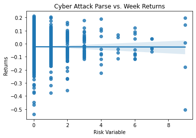
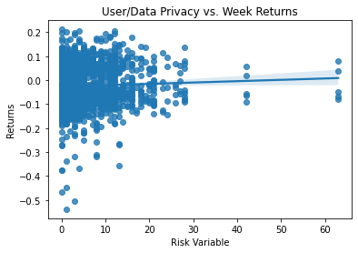
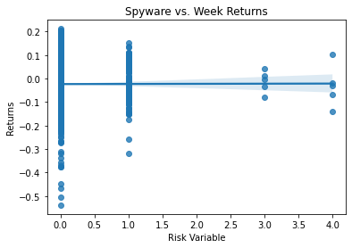
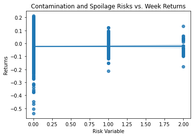
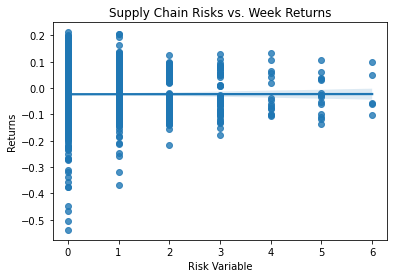

# Analysis Report


```python
# Imports

import pandas as pd
import numpy as np
import pandas_datareader as pdr # you might need to install this (see above)
from datetime import datetime 
import datetime
import matplotlib.pyplot as plt
import seaborn as sns
from io import BytesIO
from zipfile import ZipFile
from urllib.request import urlopen
import re
import os
from bs4 import BeautifulSoup
from time import sleep
from tqdm import tqdm
import random
from near_regex import NEAR_regex
```


```python
# Load the Merged Dataset containing risk measurements and returns. 

samp3_csv = 'outputs/merge_dataset.csv'
samp3 = pd.read_csv(samp3_csv)
```

## About the Following Info:
#### Below, you will find code that downloads a merged dataset with S&P 500 firms, returns data, and the risk variables that I created. I then compared the results to the returns during the week of March 9th - 13th, 2020, the start of COVID. I chose three subjects for risk variables that I hypothesized would be affected by a worldwide pandemic: Cyber Security, Contamination/Spoilage, and Supply Chains. Below, you will find a more detailed explanation of each category and the results. The risk variables were measured with the regex function. Regex counts the number of times that the words placed in the function are "hits" within a certain word boundary. 
## How were the variables measured?
#### In this analysis, I used regex (a Python coding function) to search for words that imply some sort of risk variable that a company within the sample (S&P 500 firms) may face. 

#### Below, you will find the plots that I created to visualize my findings. I also included a short description of each Risk Measure, why I chose them, and what I expected to find. Below each plot, there is a short description of how I interpreted the visualizations. 

## Why are these results valid?


### Example of a "Hit"
#### "Similar to other large multi-national companies, the size and complexity of the information technology systems on which Abbott relies for both its infrastructure and products makes them susceptible to a cyber attack, malicious intrusion, breakdown, destruction, loss of data privacy, or other significant disruption. These systems have been and are expected to continue to be the target of malware and other cyber attacks. 
- This is a short quote from the 10-K of Abbot Laborotories (one of the firms from my sample)
- In this quote, there are two exmaples of a "hit" from the regex function from my first risk measure which searches for the words "cyber" and "attack" within 15 words of each other
    - Example 1: "products makes them susceptible to a cyber attack..."
    - Example 2: "the target of malware and other cyber attacks."

### Example of What is Not a "Hit":
#### "In addition, third party hacking attempts may cause Abbott’s information technology systems and related"
- This is another short quote from the 10-K of Abbot Laboratories. 
- As you can see, the words "cyber" and "attack" do not appear in this quote. 
- THerefore, this would not register as a "hit" with the regex Python function. 

### Risk Measure 1

#### For my first risk measure, I decided to look at risks that are related to cyber security. This risk measure includes the three variations of risk variables. The coronavirus created a plethora of new challenges for businesses and as companies continue to accelerate their digital transformation, cybersecurity has become a major concern. Before conducting this test, I hypopthesized that the firms that mention these risks in their 10-K's at a higher rate would have lower returns would be for the week of March 9-13, 2020 Before running my coding analysis, I hypothesized that companies with more hits for the cyber security variables would have lower returns for the week in March 2020.  


```python
sns.regplot(data = samp3, x="Web_Risk_exp", y ="ret").set(title = "Cyber Attack Parse vs. Week Returns", ylabel = 'Returns', xlabel = 'Risk Variable') 
```


    [Text(0.5, 1.0, 'Cyber Attack Parse vs. Week Returns'),
     Text(0, 0.5, 'Returns'),
     Text(0.5, 0, 'Risk Variable')]


    

    


##### In the code above, I searched for the amount of times that the words "Cyber" and "Attack" appeared on S&P 500 firms 10-Ks. I hypothesized that as the frequency of times that these words appeared within 15 words of each other, the weekly returns would decrease. The plot shows some correlation between the risk variable and lower returns. As we move farther down the x-axis (more hits for the risk variable), firms that recorded lower returns 


```python
sns.regplot(data = samp3, 
                x="Cyb_Risk_exp", y ="ret").set(
    title = "User/Data Privacy vs. Week Returns", 
    ylabel = 'Returns', xlabel = 'Risk Variable') 
```


    [Text(0.5, 1.0, 'User/Data Privacy vs. Week Returns'),
     Text(0, 0.5, 'Returns'),
     Text(0.5, 0, 'Risk Variable')]


    

    


##### In the code above, I searched for the amount of times that the words "Data/User" and "Privacy" appeared on S&P 500 firms 10-Ks. I hypothesized that as the frequency of times that these words appeared within 15 words of each other, the weekly returns would decrease. THe plot shows that as the word count (within 15 words) increases, returns decrease.


```python
sns.regplot(data = samp3, 
                x="Spy_Risk_exp", y ="ret").set(
    title = "Spyware vs. Week Returns", 
    ylabel = 'Returns', xlabel = 'Risk Variable') 
```


    [Text(0.5, 1.0, 'Spyware vs. Week Returns'),
     Text(0, 0.5, 'Returns'),
     Text(0.5, 0, 'Risk Variable')]


    

    


##### In the code above, I searched for the amount of times that the words "Ransom/Spy" and "Ware/Risk" appeared on S&P 500 firms 10-Ks. I hypothesized that as the frequency of times that these words appeared within 15 words of each other, the weekly returns would decrease. Looking at this plot, it seems as though some firms with more mentions of these words , indicate lower returns. However, the large majority of firms had very similar word counts, and various outliers make it impossible to say that my hypothesis is concrete. 

### Risk Measure 2
#### In this analysis, I attempted to search for risks related to Contamination and Spoilage. I hypothesized that with the advent of COVID-19, more firms (such as firms in the Food and Energy Industry) would have lower returns. The rationale behind this is that as workers were being sent home, factories closed causing a higher risk of contamination of spoilage to hurt returns.


```python
sns.regplot(data = samp3, 
                x="Spoil_Risk_exp", y ="ret").set(
    title = "Contamination and Spoilage Risks vs. Week Returns", 
    ylabel = 'Returns', xlabel = 'Risk Variable') 
```


    [Text(0.5, 1.0, 'Contamination and Spoilage Risks vs. Week Returns'),
     Text(0, 0.5, 'Returns'),
     Text(0.5, 0, 'Risk Variable')]


    

    


##### In the code above, I searched for the amount of times that the words "Contaminat/Spoilage" and "Risk/Danger" appeared on S&P 500 firms 10-Ks. I hypothesized that as the frequency of times that these words increased, the weekly returns would decrease.ALthough there were not many hits for this vairable, it appears that there is some correlation to my hypothesis. As we move down the x - axis with the risk variable increasing, returns seem to decrease. 

### Risk Measure 3
#### For my final analysis, I chose to look at supply chain risks against returns. At the start of COVID-19, governments and businesses all over began dealing with supply chain issues that they had never faced before. I hypothesized that firms with 10-K's that mentioned these risks would have been hurt more when it comes to returns. 


```python
sns.regplot(data = samp3, 
                x="Supply_Risk_exp", y ="ret").set(
    title = "Supply Chain Risks vs. Week Returns", 
    ylabel = 'Returns', xlabel = 'Risk Variable') 
```


    [Text(0.5, 1.0, 'Supply Chain Risks vs. Week Returns'),
     Text(0, 0.5, 'Returns'),
     Text(0.5, 0, 'Risk Variable')]


    

    


##### In the code above, I searched for the amount of times that the words "Supply Chain/Supply" and "Risk/Shortage" appeared on S&P 500 firms 10-Ks. I hypothesized that as the frequency of times that these words appeared within 15 words of each other increased, the weekly returns would decrease. From the plot, it appears that there is some correlation although it is not very clear. Firms with 0-2 mentions of the words (within 15 words) had very little correlation to downward trending returns. As we mover further down the x-axis (word search hits are increasing), it appears as though returns are decreasing which would prove my hypothesis. 

### Statistical Analysis


```python
samp3['Web_Risk_exp'].describe()
```


    count    1750.000000
    mean        0.434286
    std         1.039512
    min         0.000000
    25%         0.000000
    50%         0.000000
    75%         1.000000
    max         9.000000
    Name: Web_Risk_exp, dtype: float64


- The first risk variable has a decent amount of hits. 
- Important Statistics:
    - Max is 9 hits
    - Mean is 0.43 hits 


```python
samp3['Cyb_Risk_exp'].describe()
```


    count    1750.000000
    mean        6.200000
    std         6.533986
    min         0.000000
    25%         2.000000
    50%         5.000000
    75%         9.000000
    max        63.000000
    Name: Cyb_Risk_exp, dtype: float64


- This risk variable has the highest number of hits out of all of my vairables. 
- Important Statistics:
    - Mean is 6.2 hits
    - Max is a very high 63 hits
- Even before COVID it seems as though firms had big concerns about cyber attacks. 


```python
samp3['Spy_Risk_exp'].describe()
```


    count    1750.000000
    mean        0.105714
    std         0.382166
    min         0.000000
    25%         0.000000
    50%         0.000000
    75%         0.000000
    max         4.000000
    Name: Spy_Risk_exp, dtype: float64


- Important Statisics:
    - Mean is 0.1
    - Max is 4
-  Because mean and max are so low, the risk measure was either not constructed well or the risk measure that I searched for (spyware and ransomware risks) is not meantioned often in the sample's (S&P 500 firms) 10-Ks.  


```python
samp3['Spoil_Risk_exp'].describe()
```


    count    1750.000000
    mean        0.097143
    std         0.357462
    min         0.000000
    25%         0.000000
    50%         0.000000
    75%         0.000000
    max         2.000000
    Name: Spoil_Risk_exp, dtype: float64


- Least amount of hits for any of my risk measures
- Important Statistics:
    - Mean is 0.09 hits
    - Max is only 2 hits
- This shows that the risk measure was either not constructed well or the risk measure that I searched for (contamination and spoilage risks) is not meantioned often in the sample's (S&P 500 firms) 10-Ks. 


```python
samp3['Supply_Risk_exp'].describe()
```


    count    1750.000000
    mean        0.482857
    std         0.964488
    min         0.000000
    25%         0.000000
    50%         0.000000
    75%         1.000000
    max         6.000000
    Name: Supply_Risk_exp, dtype: float64


- Important Statistics
    - Mean is 0.48 
    - Max is 6
- Although the mean is low, the max is relatively high compared to my other risk measures. This may show that not many firms had supply chain risk worries in their 10-K's, but those that did may consider it a big concern. 


### EDA


```python
samp3.describe()
```


<div>
<style scoped>
    .dataframe tbody tr th:only-of-type {
        vertical-align: middle;
    }

    .dataframe tbody tr th {
        vertical-align: top;
    }

    .dataframe thead th {
        text-align: right;
    }
</style>
<table border="1" class="dataframe">
  <thead>
    <tr style="text-align: right;">
      <th></th>
      <th>CIK</th>
      <th>Web_Risk_exp</th>
      <th>Cyb_Risk_exp</th>
      <th>Spy_Risk_exp</th>
      <th>Spoil_Risk_exp</th>
      <th>Supply_Risk_exp</th>
      <th>gvkey</th>
      <th>lpermno</th>
      <th>fyear</th>
      <th>sic</th>
      <th>...</th>
      <th>sales_g</th>
      <th>dv_a</th>
      <th>short_debt</th>
      <th>permno</th>
      <th>prc</th>
      <th>ret</th>
      <th>shrout</th>
      <th>vwretd</th>
      <th>week</th>
      <th>rets</th>
    </tr>
  </thead>
  <tbody>
    <tr>
      <th>count</th>
      <td>1.750000e+03</td>
      <td>1750.000000</td>
      <td>1750.000000</td>
      <td>1750.000000</td>
      <td>1750.000000</td>
      <td>1750.000000</td>
      <td>1750.000000</td>
      <td>1750.000000</td>
      <td>1750.000000</td>
      <td>1750.000000</td>
      <td>...</td>
      <td>0.0</td>
      <td>1750.000000</td>
      <td>1720.000000</td>
      <td>1750.000000</td>
      <td>1750.000000</td>
      <td>1750.000000</td>
      <td>1.750000e+03</td>
      <td>1750.000000</td>
      <td>1750.0</td>
      <td>1750.000000</td>
    </tr>
    <tr>
      <th>mean</th>
      <td>7.737542e+05</td>
      <td>0.434286</td>
      <td>6.200000</td>
      <td>0.105714</td>
      <td>0.097143</td>
      <td>0.482857</td>
      <td>45804.234286</td>
      <td>53757.260000</td>
      <td>2018.885714</td>
      <td>4333.465714</td>
      <td>...</td>
      <td>NaN</td>
      <td>0.025548</td>
      <td>0.112456</td>
      <td>53586.688571</td>
      <td>135.323731</td>
      <td>-0.023273</td>
      <td>5.677694e+05</td>
      <td>-0.019243</td>
      <td>11.0</td>
      <td>-0.023273</td>
    </tr>
    <tr>
      <th>std</th>
      <td>5.560445e+05</td>
      <td>1.039512</td>
      <td>6.533986</td>
      <td>0.382166</td>
      <td>0.357462</td>
      <td>0.964488</td>
      <td>61382.362432</td>
      <td>30182.322565</td>
      <td>0.318249</td>
      <td>1952.299462</td>
      <td>...</td>
      <td>NaN</td>
      <td>0.027021</td>
      <td>0.111727</td>
      <td>30232.435255</td>
      <td>242.927361</td>
      <td>0.087380</td>
      <td>9.510078e+05</td>
      <td>0.071568</td>
      <td>0.0</td>
      <td>0.087380</td>
    </tr>
    <tr>
      <th>min</th>
      <td>1.800000e+03</td>
      <td>0.000000</td>
      <td>0.000000</td>
      <td>0.000000</td>
      <td>0.000000</td>
      <td>0.000000</td>
      <td>1045.000000</td>
      <td>10104.000000</td>
      <td>2018.000000</td>
      <td>100.000000</td>
      <td>...</td>
      <td>NaN</td>
      <td>0.000000</td>
      <td>0.000000</td>
      <td>10104.000000</td>
      <td>3.630000</td>
      <td>-0.538647</td>
      <td>3.678000e+03</td>
      <td>-0.096841</td>
      <td>11.0</td>
      <td>-0.538647</td>
    </tr>
    <tr>
      <th>25%</th>
      <td>9.602100e+04</td>
      <td>0.000000</td>
      <td>2.000000</td>
      <td>0.000000</td>
      <td>0.000000</td>
      <td>0.000000</td>
      <td>6304.000000</td>
      <td>19502.000000</td>
      <td>2019.000000</td>
      <td>2844.000000</td>
      <td>...</td>
      <td>NaN</td>
      <td>0.000000</td>
      <td>0.026330</td>
      <td>19393.000000</td>
      <td>44.270000</td>
      <td>-0.081555</td>
      <td>1.283630e+05</td>
      <td>-0.079317</td>
      <td>11.0</td>
      <td>-0.081555</td>
    </tr>
    <tr>
      <th>50%</th>
      <td>8.751825e+05</td>
      <td>0.000000</td>
      <td>5.000000</td>
      <td>0.000000</td>
      <td>0.000000</td>
      <td>0.000000</td>
      <td>13973.000000</td>
      <td>58965.500000</td>
      <td>2019.000000</td>
      <td>3812.000000</td>
      <td>...</td>
      <td>NaN</td>
      <td>0.020574</td>
      <td>0.084983</td>
      <td>58246.000000</td>
      <td>82.990000</td>
      <td>-0.039875</td>
      <td>2.590230e+05</td>
      <td>-0.049958</td>
      <td>11.0</td>
      <td>-0.039875</td>
    </tr>
    <tr>
      <th>75%</th>
      <td>1.136893e+06</td>
      <td>1.000000</td>
      <td>9.000000</td>
      <td>0.000000</td>
      <td>0.000000</td>
      <td>1.000000</td>
      <td>61676.000000</td>
      <td>82651.000000</td>
      <td>2019.000000</td>
      <td>5531.000000</td>
      <td>...</td>
      <td>NaN</td>
      <td>0.037734</td>
      <td>0.151700</td>
      <td>82651.000000</td>
      <td>148.495000</td>
      <td>0.048724</td>
      <td>5.820540e+05</td>
      <td>0.044398</td>
      <td>11.0</td>
      <td>0.048724</td>
    </tr>
    <tr>
      <th>max</th>
      <td>1.757898e+06</td>
      <td>9.000000</td>
      <td>63.000000</td>
      <td>4.000000</td>
      <td>2.000000</td>
      <td>6.000000</td>
      <td>316056.000000</td>
      <td>93436.000000</td>
      <td>2019.000000</td>
      <td>8742.000000</td>
      <td>...</td>
      <td>NaN</td>
      <td>0.138594</td>
      <td>0.761029</td>
      <td>93436.000000</td>
      <td>3750.000000</td>
      <td>0.212121</td>
      <td>7.606047e+06</td>
      <td>0.085502</td>
      <td>11.0</td>
      <td>0.212121</td>
    </tr>
  </tbody>
</table>
<p>8 rows × 50 columns</p>
</div>


#### For some reason, after the merge the count for the sample is incorrect. This is because most firms have duplicate entries. Although the count is skewed, the returns reamin the same. 
